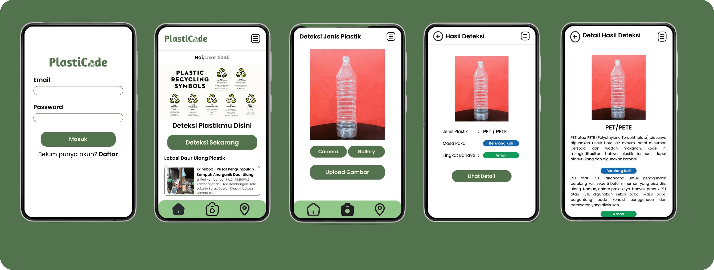
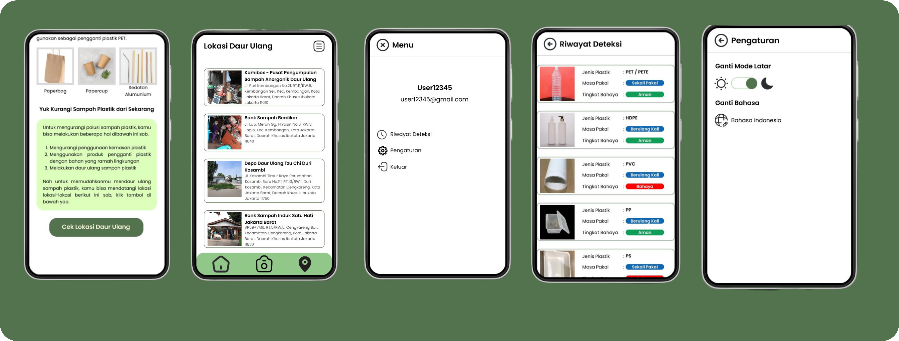

[![Contributors][contributors-shield]][contributors-url]
[![Forks][forks-shield]][forks-url]
[![Stargazers][stars-shield]][stars-url]
[![Issues][issues-shield]][issues-url]
[![MIT License][license-shield]][license-url]
[![LinkedIn][linkedin-shield]][linkedin-url]

<!-- PROJECT LOGO -->
 

  

  <h1 align="center">PlastiCode Mobile App</h3>

  

    A great application that can help you reduce plastic waste.!
     
    <a href="https://github.com/acalapatih/PlastiCode_mobileApps"><strong>Explore the docs »</strong></a>
     
     
    <a href="https://github.com/acalapatih/PlastiCode_mobileApps">View Demo</a>
    ·
    <a href="https://github.com/acalapatih/PlastiCode_mobileApps/issues">Report Bug</a>
    ·
    <a href="https://github.com/acalapatih/PlastiCode_mobileApps/issues">Request Feature</a>
  

<!-- TABLE OF CONTENTS -->

  
Table of Contents

  <ol>
    <li><a href="#introduction">Introduction</a></li>
    <li><a href="#mock-up">Mock Up</a></li>
    <li><a href="#features">Features</a></li>
    <li>
      <a href="#about-the-project">About The Project</a>
      <ul>
        <li><a href="#build-with">Build With</a></li>
        <li><a href="#project-structure">Project Structure</a></li>
      </ul>
    </li>
  </ol>

## Introduction
PlastiCode is an application that educates about the types of plastic along with their lifespan and level of danger. There are three main features in this application: plastic type detection, recommendations for plastic alternatives, and recommendations for plastic recycling locations. PlastiCode is built with Kotlin, TensorFlow Lite, and implements the Clean Code Architecture. This application was developed as the Capstone Project Bangkit 2023.

## Mock Up
### Detection Feature

### Location and Setting Feature

## Features
- Splash Screen
- Login & Register
- Dashboard
- Plastic Type Detection
- Plastic Type Detection Result
- Detection Result Details
- Plastic Recycling Recommendations
- Menu
- Detection History
- Background Mode Setting

## About The Project
### Build With
- [Lifecycle & Livedata](https://developer.android.com/guide/components/activities/activity-lifecycle?hl=id)
- [Retrofit](https://square.github.io/retrofit/)
- [Navigation Component](https://developer.android.com/guide/navigation/get-started)
- [Kotlin Coroutines](https://www.googleadservices.com/pagead/aclk?sa=L&ai=DChcSEwiU2bPz88f_AhXVk2YCHXdgDDMYABAAGgJzbQ&ohost=www.google.com&cid=CAESbOD2gWGIEaIzh7xPUOGICyK2tbXIr0QUhhlGSrurjKcD6swxwpKj-7IrQ9_iwmDhml1_P_z6seVQZZNvkJ-fiMxTpf1xONyVn40ucS143xA8HR8Y35CCv_06CgyhYufQQc6JFf2g1WPjknZFow&sig=AOD64_1YR8UhDwd6LH3WrvCacezcHvoFUw&q&adurl&ved=2ahUKEwiUqKzz88f_AhUT7TgGHSukAJEQ0Qx6BAgIEAE)
- [Ok Http 3](https://square.github.io/okhttp/)
- [GSON](https://github.com/google/gson)
- [Glide](https://github.com/bumptech/glide)
- [Google Maps Services, Places API](https://developers.google.com/maps/documentation/places/android-sdk/overview)
- [Fragment](https://developer.android.com/guide/fragments?hl=id)
- [ViewModel](https://developer.android.com/topic/libraries/architecture/viewmodel?hl=id)
- [TensorFlow Lite](https://www.tensorflow.org/lite/android)
- [RxBinding](https://github.com/JakeWharton/RxBinding)

### Project Structure
- data
- factory
- network
	- ApiService
	- GoogleMapsApiService
	- ApiConfig
	- GoogleMapsApiConfig
- preference
- response
- ui
	- dashboard
	- detection
	- result
	- login
	- location
	- main
	- menu
	- setting
	- register
	- history
- utils
	- dataStore
- ml
	- model.tflite

<!-- MARKDOWN LINKS & IMAGES -->
<!-- https://www.markdownguide.org/basic-syntax/#reference-style-links -->
[contributors-shield]: https://img.shields.io/github/contributors/acalapatih/PlastiCode_mobileApps.svg?style=for-the-badge
[contributors-url]: https://github.com/acalapatih/PlastiCode_mobileApps/graphs/contributors
[forks-shield]: https://img.shields.io/github/forks/acalapatih/PlastiCode_mobileApps.svg?style=for-the-badge
[forks-url]: https://github.com//acalapatih/PlastiCode_mobileApps/network/members
[stars-shield]: https://img.shields.io/github/stars/acalapatih/PlastiCode_mobileApps.svg?style=for-the-badge
[stars-url]: https://github.com//acalapatih/PlastiCode_mobileApps/stargazers
[issues-shield]: https://img.shields.io/github/issues/acalapatih/PlastiCode_mobileApps.svg?style=for-the-badge
[issues-url]: https://github.com//acalapatih/PlastiCode_mobileApps/issues
[license-shield]: https://img.shields.io/github/license/acalapatih/PlastiCode_mobileApps.svg?style=for-the-badge
[license-url]: https://github.com//acalapatih/PlastiCode_mobileApps/blob/master/LICENSE.txt
[linkedin-shield]: https://img.shields.io/badge/-LinkedIn-black.svg?style=for-the-badge&logo=linkedin&colorB=555
[linkedin-url]: https://linkedin.com/in/amir-acalapati-henry
